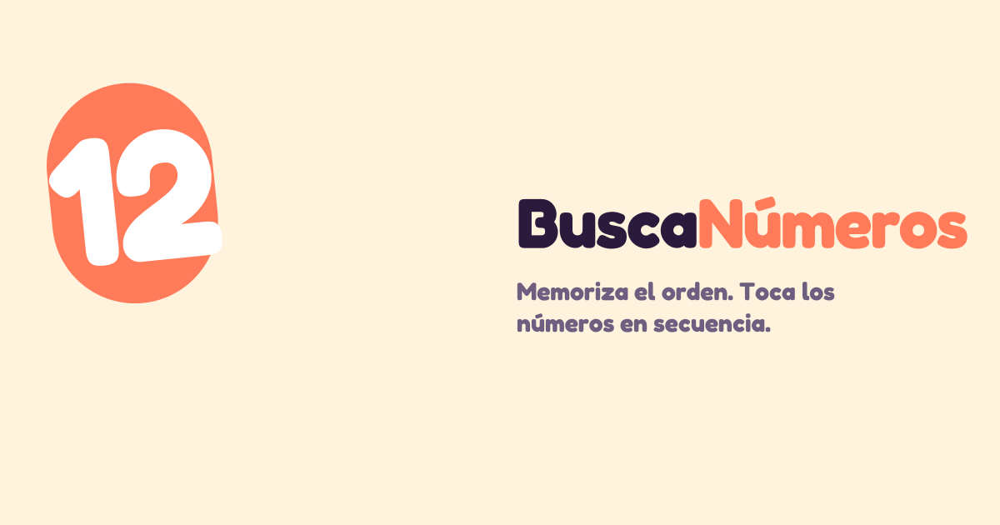

<div align="center">

# 🔢 BuscaNúmeros



**Memoriza el orden. Toca los números en secuencia. Bate tu récord.**

Juego *mobile-first* de memoria y velocidad, construido con Next.js 16, React 19 y TypeScript.

<br>


</div>

---

## ✨ Características

| | |
|---|---|
| 🎮 **Tres modos** | Cuenta atrás (penaliza el error), Clásico (un fallo y pierdes) y Relax (sin presión). |
| 🔲 **Grids adaptativos** | Tableros 5×5, 7×7 y 10×10 que se ajustan vía *container queries*. |
| 🏆 **Récords** | Marcas guardadas por configuración, con filtros por grid, modo y duración. |
| 🔊 **Feedback** | Sonido sintetizado con Web Audio, vibración háptica y modo oscuro. |
| 💾 **Persistencia** | Ajustes y récords se conservan en `localStorage`. |

## 🚀 Empezar

```bash
pnpm install
pnpm dev
```

Abre **[localhost:3000](http://localhost:3000)** y a jugar.

```bash
pnpm build   # build de producción
pnpm lint    # análisis estático
```

## 🗂️ Estructura

```
app/                 layout, estilos globales (tokens y animaciones) y página
components/
  ui/                primitivas reutilizables (Button, Segmented, Switch…)
  screens/           pantallas (home, game, result, records, settings)
lib/                 dominio: tipos, config, store, audio, háptica y formato
hooks/               hooks compartidos (useNow, useClientValue)
```

> [!TIP]
> ¿Vas a trabajar en el proyecto? Empieza por [`AGENTS.md`](AGENTS.md) y la documentación detallada en [`docs/INDEX.md`](docs/INDEX.md).

<div align="center">
<br>
<sub>Hecho con ☕ y un poco de obsesión por los récords.</sub>
</div>
